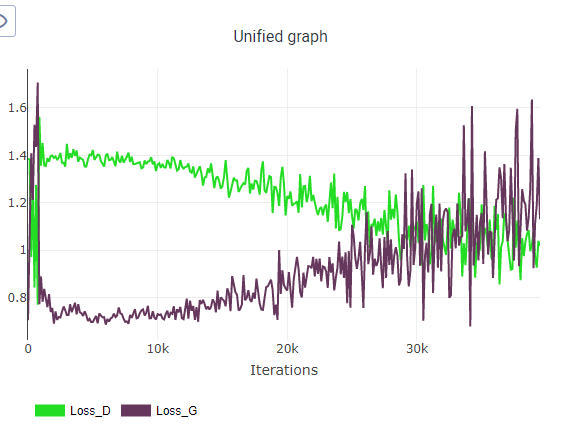

# gan_edu

1. рисуем архитектуру: ✓
      - на основе DCGAN ✓
      - блоки меняем на csp ✓
2. запустить обучение на celeba ✓
3. логировать лоссы и промежуточные картинки в clearml или tensorboard\weightandbias ✓
4. добиться сходимости +-
5. попробовать разные варианты лоссов и регуляризаций ✓
6. сравнить обучение при разных подходах ✓
7. сравнить с сеткой на Resnet блоках классических ✓

### Получилось, что скрипты по большей части схожи, но решил не городить опциональность в одном скрипте (тип блоков, регуляризации и т.д.) в угоду наглядности по папкам.

### В ClearML логгируются лоссы, картинки и конфиг

# Classic conv2d DCGAN

#### ClearML:

- https://app.clear.ml/projects/2af2259f92214592a6138edffb0893aa/experiments/b1d0b95dfcb042fea9ac4e84d4e53caa/output/execution
- https://app.clear.ml/projects/2af2259f92214592a6138edffb0893aa/experiments/ba5137c826bf4e5bbca66e126e5a756f/output/execution
- https://app.clear.ml/projects/2af2259f92214592a6138edffb0893aa/experiments/2544b6f5da914e2589556a94892c2925/output/execution
- https://app.clear.ml/projects/2af2259f92214592a6138edffb0893aa/experiments/d2e37dbe6660433384d30d707597588c/output/execution
- https://app.clear.ml/projects/2af2259f92214592a6138edffb0893aa/experiments/d2e37dbe6660433384d30d707597588c/output/execution
- https://app.clear.ml/projects/2af2259f92214592a6138edffb0893aa/experiments/4934d1ed503b4cfd872dc1b28357270e/output/execution

#### Из опробованного:
- dropout c разными p, как G+D, так и только в D 
- разные batchsize, LR

  

# DCGAN CSP

#### ClearML:

- https://app.clear.ml/projects/2af2259f92214592a6138edffb0893aa/experiments/c9aa67493bd143eea73b7f95366d4eeb/output/execution
- https://app.clear.ml/projects/2af2259f92214592a6138edffb0893aa/experiments/c9aa67493bd143eea73b7f95366d4eeb/output/execution

#### Из опробованного:

- dropout c разными p, как G+D, так и только в D 
- разные batchsize, LR

  

# DCGAN ResNet
#### ClearML:

- https://app.clear.ml/projects/2af2259f92214592a6138edffb0893aa/experiments/c9aa67493bd143eea73b7f95366d4eeb/output/execution
- https://app.clear.ml/projects/2af2259f92214592a6138edffb0893aa/experiments/31881003a69446c9a27583d4223c1003/output/execution
- https://app.clear.ml/projects/2af2259f92214592a6138edffb0893aa/experiments/4e04ecb2874a4caf9784317c5eed771c/output/execution
- https://app.clear.ml/projects/2af2259f92214592a6138edffb0893aa/experiments/312a75677fe140f5a9c40123211ac541/output/execution
- https://app.clear.ml/projects/2af2259f92214592a6138edffb0893aa/experiments/6ebac9d747b74a1a84787fb17499de5e/output/execution

#### Из опробованного:
- dropout c разными p, как G+D, так и только в D 
- разные batchsize, LR, adamW для дискриминатора

  
